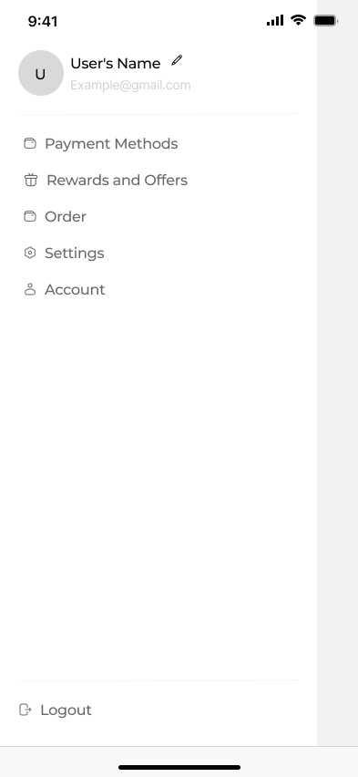

# Project FoodDelivery For App Mobile

Projeto Pessoal de uma replica do ***Ifood*** usando desing do ***Figma community*** com o intuito de conhecer tecnologias e aprimora habilidades no desenvolvimento Mobile usando ***Tecnolgias Hibidas*** para Ambos os dispositivos ***Ios e Android***.

## Principais Tecnologias Usandas no Projeto:

 

 

* ***React Native***
* ***Expo Go***
* ***React Navigation***
* ***Android Studio***

## Desing do Projeto No Figma Community 

Para esse projeto eu em especial prefirir usar um Design pronto no intuito de ser algum mais focado no desenvolvimento Mobile e conceitos importantes a serem estudados para o projeto. 

<h3>Telas inicial juntamente com a navegacao do app </h3>

 

<h3>Telas relacionada a pedidos do app restaurante </h3>

## Formato de Navegacao usando no App criado

 

 

Foi usando a biblioteca React Navigation que permitiu usar no projeto todos os tres tipos de navegacao possiveis em um projeto de tamanho medio como esse que foi feito que sao: 

* <a href='https://reactnavigation.org/docs/stack-navigator' style="color: white">Stack Navigator</a>

* <a href='https://reactnavigation.org/docs/bottom-tab-navigator' style="color: white">Bottom Tabs Navigator</a>

* <a href='https://reactnavigation.org/docs/drawer-navigator' style="color: white">Drawer Navigator</a>

 
Obs:. todos sao links clicaveis para documentacao oficial.

